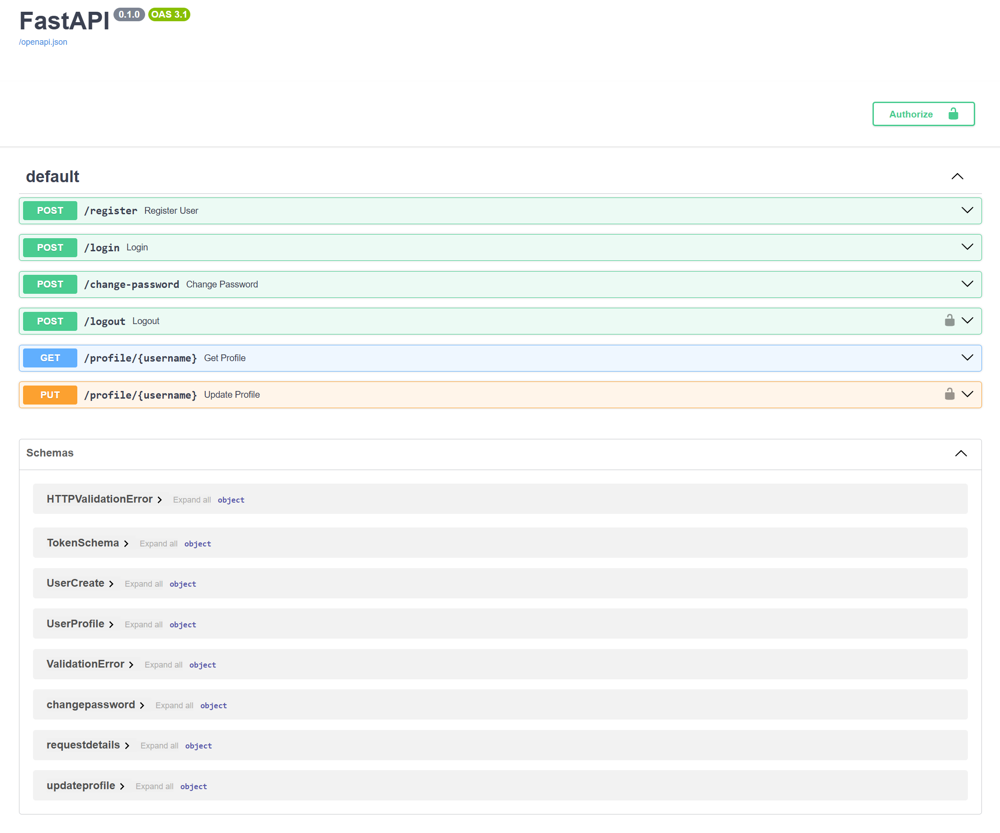

# System Uwierzytelniania Użytkowników FastAPI



## Przegląd

Ten projekt implementuje system uwierzytelniania użytkowników przy użyciu FastAPI. Zapewnia funkcje rejestracji użytkownika, logowania, zarządzania hasłami oraz aktualizacji profilu. System uwierzytelniania opiera się na tokenach JWT, co umożliwia bezpieczny dostęp i obsługę sesji.

### Kluczowe Funkcje:
- **Rejestracja Użytkownika**: Tworzenie nowego konta użytkownika.
- **Logowanie Użytkownika**: Uwierzytelnianie użytkownika za pomocą tokenów dostępu i odświeżania JWT.
- **Zmiana Hasła**: Bezpieczna aktualizacja hasła użytkownika.
- **Zarządzanie Profilem**: Przeglądanie i aktualizacja informacji o profilu.
- **Wylogowanie Użytkownika**: Unieważnianie tokenów sesji użytkownika.

## Wymagania

- **Python** 3.8+
- **FastAPI** do tworzenia API
- **SQLAlchemy** do zarządzania bazą danych
- **bcrypt** do hashowania haseł
- **PyJWT** do obsługi JWT

Instalacja wymaganych pakietów:

```bash
pip install fastapi uvicorn sqlalchemy bcrypt python-jose
```

## Struktura Projektu

- `main.py` - Główny plik aplikacji zawierający endpointy i inicjalizację aplikacji.
- `auth_bearer.py` - Obsługa JWT, w tym weryfikacja i walidacja tokenów.
- `database.py` - Konfiguracja bazy danych i obsługa sesji.
- `models.py` - Modele SQLAlchemy definiujące tabele User i Token.
- `schemas.py` - Schematy Pydantic do walidacji danych.
- `utils.py` - Funkcje pomocnicze do hashowania haseł i generowania tokenów.

## Pierwsze Kroki

1. **Konfiguracja Bazy Danych**:
   Baza danych SQLite (`baza_danych.db`) zostanie utworzona przy inicjalizacji.

2. **Uruchomienie Aplikacji**:
   Uruchom aplikację za pomocą Uvicorn:

   ```bash
   uvicorn main:app --reload
   ```

   Odwiedź `http://127.0.0.1:8000/docs`, aby uzyskać dostęp do dokumentacji API i przetestować endpointy.

## Endpointy API

1. **Rejestracja Użytkownika**: 
   - `POST /register` - Rejestracja nowego użytkownika.
  
2. **Logowanie Użytkownika**: 
   - `POST /login` - Uwierzytelnienie użytkownika i zwrócenie tokenów dostępu oraz odświeżania.
  
3. **Zmiana Hasła**:
   - `POST /change-password` - Pozwala użytkownikowi na aktualizację hasła.
  
4. **Profil Użytkownika**:
   - `GET /profile/{username}` - Pobiera szczegóły profilu użytkownika.
   - `PUT /profile/{username}` - Aktualizuje informacje o profilu użytkownika.
  
5. **Wylogowanie Użytkownika**:
   - `POST /logout` - Unieważnia tokeny użytkownika, aby wylogować użytkownika.

## Bezpieczeństwo

- Hasła są hashowane przy użyciu bcrypt.
- Tokeny dostępu i odświeżania są zarządzane przy użyciu bezpiecznych JWT z ustawieniami wygaśnięcia.
- Sesje bazy danych i weryfikacja tokenów zapewniają bezpieczne transakcje.

## Licencja

Ten projekt jest licencjonowany na zasadach licencji MIT.
